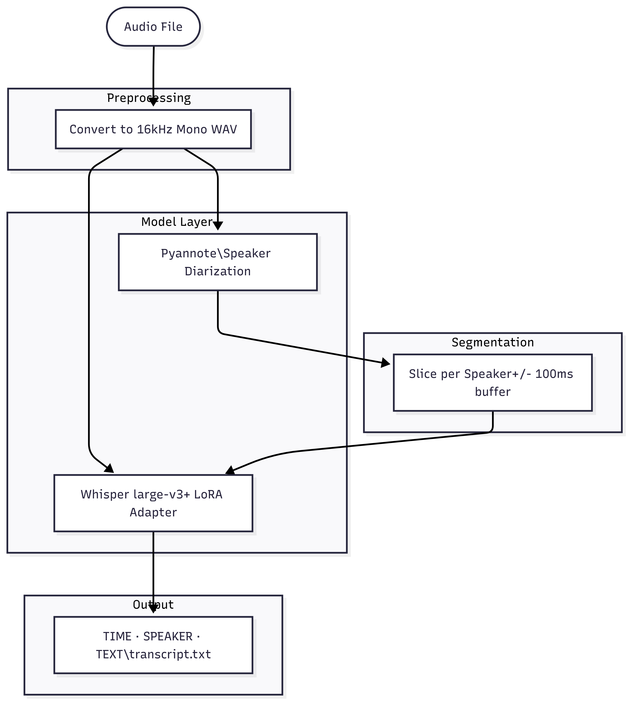
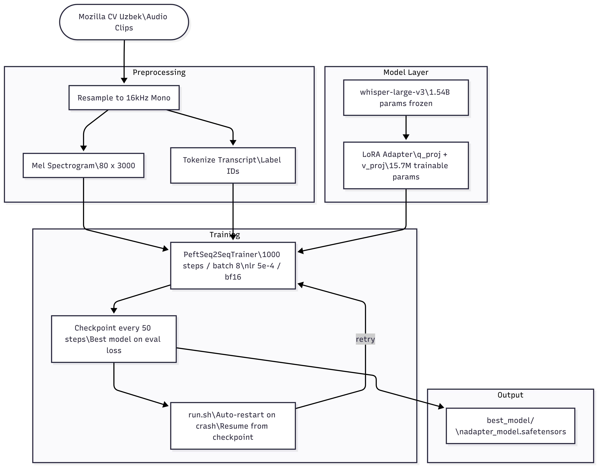

# WhoSaidWhatWhen — Uzbek

> Automatically identifies **who spoke**, **when**, and **what they said** — in Uzbek.

A production-ready speaker diarization and transcription pipeline built on a custom fine-tuned Whisper Large-v3 LoRA adapter, trained specifically on native Uzbek conversational speech.

The pre-trained adapter is publicly available on HuggingFace → [AnvarMexmonov/uz-speech-adapter-v1](https://huggingface.co/AnvarMexmonov/uz-speech-adapter-v1)

---

## What I Built

**Custom Uzbek ASR Adapter**
[openai/whisper-large-v3](https://huggingface.co/openai/whisper-large-v3) is a general multilingual model — capable in Uzbek, but not optimised for it. Using [LoRA (Low-Rank Adaptation)](https://arxiv.org/abs/2106.09685), only 1% of the model's parameters (15.7M out of 1.55B) were fine-tuned on 3,000 Uzbek audio clips from [Mozilla Common Voice](https://huggingface.co/datasets/yakhyo/mozilla-common-voice-uzbek), making it significantly more accurate on native Uzbek speech without losing the base model's general capabilities.

**Fault-Tolerant Training System**
Training Whisper Large-v3 on a consumer GPU regularly triggers `SIGSEGV` crashes from CUDA memory fragmentation and HuggingFace Arrow/mmap conflicts. This was solved by replacing Arrow-backed datasets with a crash-safe plain PyTorch dataset stored in RAM, and writing a `run.sh` watchdog that auto-resumes from the latest checkpoint after any crash — no lost progress.

---

## Architecture

### Diarization + Transcription Pipeline

<!-- Add diag_pipeline.png here -->
<p align="center">
  
</p>

---

### Fine-tuning Architecture

<!-- Add diag_finetune.png here -->
<p align="center">
  
</p>


## Project Structure

```
WhoSaidWhatWhen-Uzbek/
├── assets/                    # Architecture diagrams
├── dataset/
│   └── downloading.py         # Dataset structure verifier
├── fine-tune/
│   ├── dataloader.py          # Crash-safe dataset loader
│   ├── model.py               # Whisper + LoRA configuration
│   ├── train.py               # Training loop with auto-resume
│   └── run.sh                 # Fault-tolerant restart wrapper
└── inference/
     ├── inference.py           # Single-file transcription
     └── final.py               # Full diarization pipeline
```

---

## Installation

Make sure you have Python 3.10+ and a CUDA-capable GPU, then install the required packages:

`torch` `transformers` `peft` `datasets` `pyannote.audio` `pydub` `librosa` `safetensors`

You will also need a [HuggingFace account](https://huggingface.co/join) and access token to download the [pyannote diarization model](https://huggingface.co/pyannote/speaker-diarization-3.1) — accept its terms on the model page first.

---

## How to Use

**Transcribe a single audio file**
Set your audio file path inside `inference/inference.py`, then run it. The LoRA adapter downloads automatically from HuggingFace on the first run.

**Full diarization — who said what and when**
Set your audio file path inside `inference/final.py`, then run it. Output is printed to the terminal and saved as a `.txt` file next to your audio.

**Re-train or continue training**
Run `bash fine-tune/run.sh` from the project root. It automatically detects and resumes from the latest checkpoint if one exists. Set `MAX_STEPS` inside `train.py` to control how long to train.

---

## Training Details

| | |
|---|---|
| Base model | [openai/whisper-large-v3](https://huggingface.co/openai/whisper-large-v3) |
| Fine-tuning method | [LoRA](https://arxiv.org/abs/2106.09685) via [HuggingFace PEFT](https://github.com/huggingface/peft) |
| LoRA targets | q_proj, v_proj |
| LoRA rank / alpha | 32 / 64 |
| Trainable params | 15.7M / 1.55B (1%) |
| Dataset | [Mozilla Common Voice — Uzbek](https://huggingface.co/datasets/yakhyo/mozilla-common-voice-uzbek) |
| Train samples | 3,000 clips |
| Eval samples | 200 clips |
| Steps | 1,000 |
| Effective batch size | 8 |
| Learning rate | 5e-4 with 50-step warmup |
| Precision | bf16 |
| GPU | NVIDIA RTX 5090 |
| Training time | ~90 minutes |
| Best eval loss | **0.7835** |

---

## Acknowledgements

- [Whisper](https://openai.com/research/whisper) by OpenAI — base speech recognition model
- [pyannote.audio](https://github.com/pyannote/pyannote-audio) — speaker diarization framework
- [LoRA](https://arxiv.org/abs/2106.09685) — Hu et al., 2021 — parameter-efficient fine-tuning
- [Mozilla Common Voice](https://commonvoice.mozilla.org) — open Uzbek speech dataset
- [HuggingFace PEFT](https://github.com/huggingface/peft) — fine-tuning library

---

## License

This project is licensed under the MIT License.

If you use this project in your research, please cite it as:

```bibtex
@software{mexmonov2026whosaidwhatwhen-uzbek,
  author       = {Anvar Mexmonov},
  title        = {WhoSaidWhatWhen: Speaker Diarization and ASR Pipeline v2},
  year         = {2026},
  url          = {[https://github.com/anvarmexmonov/WhoSaidWhatWhen-Uzbek](https://github.com/anvarmexmonov/WhoSaidWhatWhen-Uzbek)}
}
